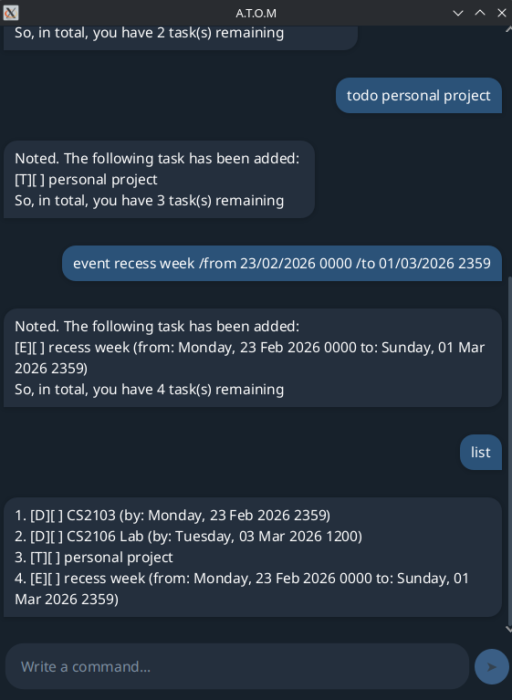

# ATOM (Assistant Task Organisation Manager) User Guide

**ATOM** is a powerful, lightweight desktop chatbot app designed to help you reclaim your focus by offloading your
mental to-do list
into a streamlined terminal interface.

It's:

* terminal-centric
* incredibly intuitive
* ~~COMPLEX~~ *SUPER* SIMPLE to master

All you need to do is,

1. Ensure to install Java 17 on your computer system.
2. Download the latest `atom.jar` file from [here](https://github.com/David-The-Programmer/ip/releases).
3. Move the `atom.jar` into a folder of your choosing.
4. In your terminal `cd` to that folder and run `java -jar atom.jar`.

A chat window should appear (similar to the one below):

---

## Feature: Add ToDo

Adds a simple task without any date or time constraints.

**Format:** `todo <description>`

**Examples:**

* `todo read book`
* `todo buy groceries`

---

## Feature: Add Deadline

Adds a task that must be completed by a specific date and time.

**Format:** `deadline <description> /by <date> <time>`

**Examples:**

* `deadline submit report /by 2026-02-23 2359`
* `deadline fix bug /by 23/02/2026 1800`

---

## Feature: Add Event

Adds a task that occurs within a specific time range.

**Format:** `event <description> /from <date> <time> /to <date> <time>`

**Examples:**

* `event career fair /from 2026/02/24 0900 /to 2026/02/24 1700`
* `event project meeting /from 25-02-2026 1400 /to 25-02-2026 1600`

---

## Feature: List Tasks

Displays a numbered list of all your currently tracked tasks and their status.

**Format:** `list`

**Example:**

* `list`

---

## Feature: Mark Task

Marks a specific task as completed using its index number from the list.

**Format:** `mark <task number>`

**Example:**

* `mark 1`

---

## Feature: Unmark Task

Reverts a completed task back to an incomplete status.

**Format:** `unmark <task number>`

**Example:**

* `unmark 1`

---

## Feature: Delete Task(s)

Removes one or more tasks from your list. You can provide multiple task numbers separated by spaces to perform a mass
deletion.

**Format:** `delete <task number a> <optional task number b> ...`

**Examples:**

* `delete 1`
* `delete 1 3 5` (Removes tasks 1, 3, and 5 simultaneously)

---

## Feature: Find Tasks

Searches for tasks whose descriptions contain the specified keyword.

**Format:** `find <keyword>`

**Example:**

* `find book` (will match "read book", "return library book", etc.)

---

## Feature: Exit

Closes the ATOM application.

**Format:** `bye`

**Example:**

* `bye`

---

## 📝 Technical Note on Inputs

* **Dates:** ATOM supports flexible date formats. You can use `/` or `-` as separators.
    * Accepted: `YYYY/MM/DD`, `YYYY-MM-DD`, `DD/MM/YYYY`, `DD-MM-YYYY`
* **Time:** Always use the 24-hour **HHmm** format (e.g., `1800` for 6:00 PM).
* **Mass Delete:** To ensure safety, mass deletion is **atomic**. If any task number in your list is invalid (e.g., a
  typo or out-of-bounds number), the entire command is rejected and no tasks will be deleted.

---

## ATOM Command Summary

| Feature      | Command Format                                              | Purpose                                                 |
|:-------------|:------------------------------------------------------------|:--------------------------------------------------------|
| **ToDo**     | `todo <description>`                                        | Adds a todo task to the list.                           |
| **Deadline** | `deadline <description> /by <date> <time>`                  | Adds a deadline task with a single completion deadline. |
| **Event**    | `event <description> /from <date> <time> /to <date> <time>` | Adds a event task with a start and end time.            |
| **List**     | `list`                                                      | Displays all tasks with their current status.           |
| **Mark**     | `mark <task number>`                                        | Sets a specific task to **Completed**.                  |
| **Unmark**   | `unmark <task number>`                                      | Sets a specific task back to **Incomplete**.            |
| **Delete**   | `delete <number A> <number B>...`                           | Removes one or many tasks (Atomic operation).           |
| **Find**     | `find <keyword>`                                            | Filters the list by a specific search term.             |
| **Exit**     | `bye`                                                       | Saves data and closes the application.                  |

---

### Input Requirements Reference

| Input Type | Accepted Formats                                       |
|:-----------|:-------------------------------------------------------|
| **Date**   | `YYYY/MM/DD`, `YYYY-MM-DD`, `DD/MM/YYYY`, `DD-MM-YYYY` |
| **Time**   | `HHmm` (24-hour format, e.g., `2359`)                  |
| **Index**  | Positive integers corresponding to the `list` output.  |
